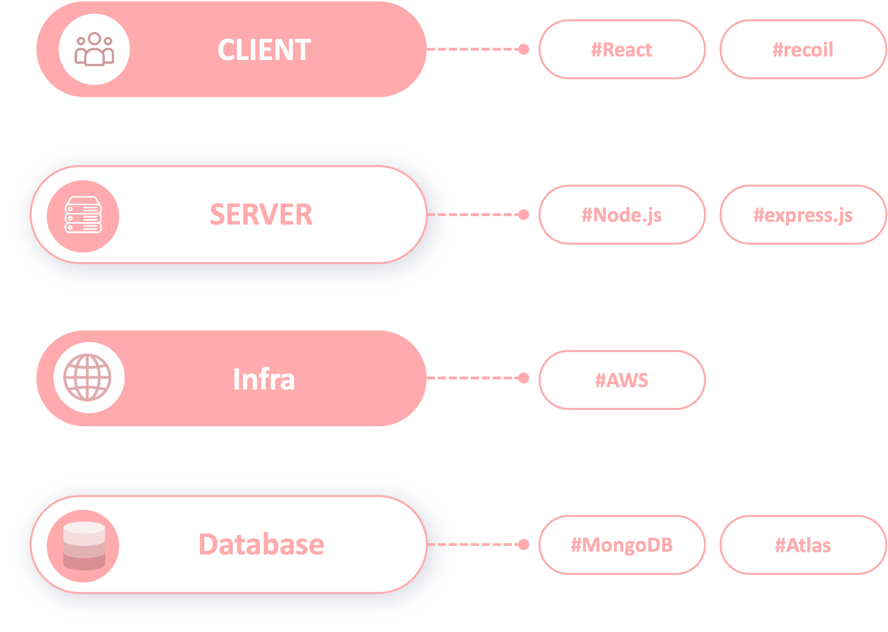
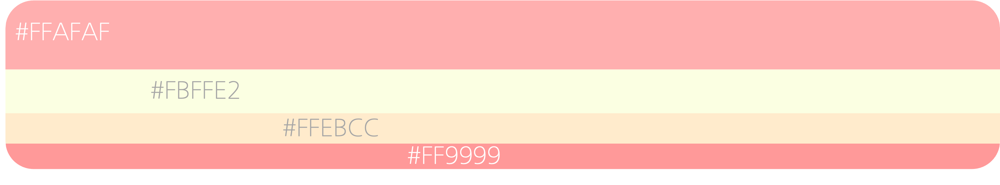

# Welcome to \<Calendar/>

> 나의 감정을 사진과 함께 기록하는 포토캘린더

# 💻 개발환경

# 👩‍💻 주요기능

### 무한스크롤

[이미지]

### 게시글 작성

[이미지]

### 게시글 수정

[이미지]

### 게시글 삭제

[이미지]

### 좋아요 기능

[이미지]

### LikePage

[이미지]

# kakao Oauth

## 구조

[이미지]

### Jwt 토큰으로 관리

[이미지]

# 🗄 디렉토리 구조

[폴더 구조]

# Team Snail

|                                                                 팀원                                                                  |  포지션  |
| :-----------------------------------------------------------------------------------------------------------------------------------: | :------: |
|   [정진우](https://github.com/jinux127)   | Frontend |
|   [박노준](https://github.com/Circlewee)  | Frontend |
|  [김성은](https://github.com/Seongeuniii) | Frontend |
|    [주지호](https://github.com/kypa123)   | Backend  |
|    [조재홍](https://github.com/hong1995)  | Backend  |
|     [김지호](https://github.com/sokojh)   | Backend  |

### Color System

